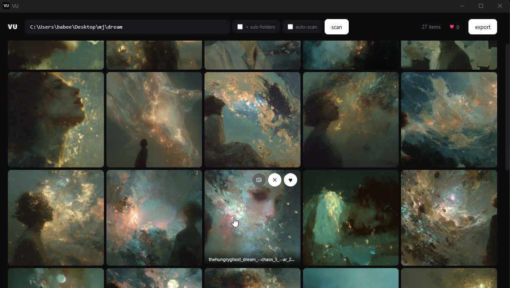

# VU

A minimal media viewer that lives in your tray. Press a hot-key (settings) in any
Windows Explorer / Finder window and VU pops open, pre-scanned to that folder.
Click tiles to select, compare two side-by-side, heart favorites, export your
selects as a folder or zip.

**[Download the latest release →](https://github.com/spiritform/vu/releases/latest)**



## Features

- Folder grid (images + videos) with lazy thumbnails cached in `.thumbs/`
- Single / multi-select: click · ctrl+click · shift+click range
- Side-by-side compare of any two items (keyboard: `C`)
- Heart to favorite, filter by hearted, export selected to a new folder or zip
- Drag any tile to your desktop to save a copy (filename preserved)
- Lives in the system tray; window closes to tray, not quits
- Global / custom hotkey `Ctrl+Shift+V` — opens VU in the focused Explorer / Finder
  folder

## Running (dev)

```
pip install -r requirements.txt
python main.py
```

Requires `ffmpeg` on `PATH` for video thumbnails.

## Building a single-file exe / app

### Windows

Double-click `build.bat` or run it from a terminal. Output: `dist/VU.exe`.

### macOS

```
chmod +x build.sh
./build.sh
```

Output: `dist/VU.app`. The build script downloads a static ffmpeg into the
bundle automatically — you don't need to install it system-wide.

The global `Ctrl+Shift+V` hotkey is registered through the Carbon Event Manager,
so it works out of the box — no Accessibility or Input Monitoring permission
needed.

Cross-compilation is not supported — build Windows exes on Windows, Mac apps
on Mac.

## Keyboard shortcuts

| Key                   | Action                                          |
| --------------------- | ----------------------------------------------- |
| `click`               | Select only this tile                           |
| `ctrl+click`          | Toggle tile in/out of selection                 |
| `shift+click`         | Range-select from anchor to this tile           |
| `double-click`        | Open tile in full view                          |
| `C`                   | Compare (requires exactly 2 selected)           |
| `H`                   | Heart/unheart selected                          |
| `Delete` / `Backspace`| Remove selected from viewer (file stays on disk)|
| `F`                   | Toggle heart filter                             |
| `Esc`                 | Clear selection / close overlays                |
| `← / →`               | Prev / next in full view                        |

## State files

VU stores everything centrally so your folders stay clean:

- Windows: `%APPDATA%\VU\`
- macOS:   `~/Library/Application Support/VU/`

Inside that directory:

- `hearts/<folder-hash>.json` — hearted files for each folder you've scanned
- `thumbs/<folder-hash>/`     — cached thumbnails (safe to delete to regenerate)

"Removed from viewer" items are session-only — a fresh scan brings them back.
